# CampusCoins System Architecture

## Overview
**CampusCoins** is a gamified college complaint and campus assistance platform operating under the core philosophy:
**"Report. Resolve. Earn. Improve."**

The platform enables students to report genuine campus issues (infrastructure, sanitation, academics, lab equipment), track progress in real-time, earn verifiable CampusCoins upon resolution verification, and navigate the campus environment.

---

## Architecture Diagram

```mermaid
flowchart TD
    subgraph Client["Client Layer (Frontend)"]
        Student["Student Portal"]
        Staff["Staff / Department Portal"]
        Admin["College Admin Portal"]
        UI["React 18 + Vite + Tailwind CSS"]
        Student --> UI
        Staff --> UI
        Admin --> UI
    end

    subgraph Gateway["API & Backend Layer"]
        API["Node.js + Express API Gateway (Port 5000)"]
        AuthMid["Auth & Role-based Access Middleware"]
        RateLimit["Rate Limiter & Security (Helmet, CORS)"]
        HealthCheck["Health & Diagnostics Controller"]
        API --> RateLimit
        RateLimit --> AuthMid
        RateLimit --> HealthCheck
    end

    subgraph Persistence["Data & Storage Layer"]
        SupabaseDB[("Supabase PostgreSQL")]
        SupabaseAuth["Supabase Auth (JWT)"]
        SupabaseStorage["Supabase Storage (Issue Photos)"]
        SupabaseRealtime["Supabase Realtime (Live updates)"]
    end

    subgraph Intelligence["Future AI Layer (Phase 3)"]
        AIService["FastAPI AI Microservice (Python)"]
        VisionAI["Image Verification & Classification"]
        Deduplication["Semantic Duplicate Complaint Detection"]
        AIService --> VisionAI
        AIService --> Deduplication
    end

    subgraph Navigation["Future Campus Navigation (Phase 4)"]
        NavEngine["Campus Navigation Engine"]
        GeoData["OpenStreetMap / MapLibre"]
        Routing["A* / Dijkstra Shortest Path Router"]
        NavEngine --> GeoData
        NavEngine --> Routing
    end

    subgraph Notifications["Notification & Reward Layer (Phase 5)"]
        NotifService["Notification Service (Push / Email / In-App)"]
        WalletEngine["CampusCoins Ledger & Token Manager"]
    end

    UI -->|"HTTP / REST / WebSocket"| API
    API -->|"PostgreSQL / Auth / Storage"| SupabaseDB
    API --> SupabaseAuth
    API --> SupabaseStorage
    API --> SupabaseRealtime
    API -.->|"Async REST"| AIService
    API -.->|"Graph Queries"| NavEngine
    API -.->|"Event Dispatch"| NotifService
    API -.->|"Transactions"| WalletEngine
```

---

## Layer-by-Layer Breakdown

### 1. Client Layer (Frontend)
- **Framework**: React 18, Vite 5, React Router 6.
- **Styling & Design System**: Tailwind CSS v3 with custom dark-first theme, glassmorphic card overlays, soft cyan/emerald gradients, and responsive layout primitives.
- **Component Architecture**: Atomic reusable components (`Button`, `Input`, `Select`, `Modal`, `Card`, `Badge`, `LoadingSpinner`, `EmptyState`, `ErrorState`, `PageHeader`, `Navbar`, `Sidebar`).
- **State Management**: Context API for Mock/Supabase Authentication, React Query for server caching.
- **Validation**: React Hook Form with Zod schema validation.

### 2. API & Gateway Layer (Backend)
- **Runtime**: Node.js v20+ / v22 with Express.js.
- **Security & Hardening**: `helmet` for HTTP headers, `cors` for cross-origin isolation, `express-rate-limit` for DDoS prevention.
- **Routes & Controllers**: Clean separation between routing, business controllers, and abstract services.
- **Standardized Responses**: Centralized response utility `{ success, message, data }` and error middleware catching uncaught exceptions and 404s.
- **Diagnostics**: `GET /api/health` providing real-time backend operational status.

### 3. Data & Storage Layer
- **PostgreSQL Database** (managed via Supabase) for transactional relational entities: Users, Roles, Complaints, Category taxonomy, Status history, Coin ledger, and Department routing.
- **Supabase Auth**: JWT-based session security with Role-Based Access Control (RBAC: `student`, `staff`, `admin`).
- **Supabase Storage**: S3-compatible object storage for before-and-after resolution proof photos.
- **Supabase Realtime**: Live WebSocket notifications when ticket states transition.

### 4. AI Service Layer (Phase 3)
- **FastAPI Python microservice** for asynchronous batch and near-real-time inference:
  - Multimodal image classification to verify issue legitimacy.
  - Text embedding deduplication (detecting when 10 students report the same broken water cooler).
  - Department routing and urgency scoring.

### 5. Navigation Engine (Phase 4)
- Interactive indoor and outdoor college campus mapping powered by OpenStreetMap, MapLibre GL, and graph search algorithms (Dijkstra / A*) for quick routing between blocks, labs, administrative offices, and reported issue sites.

### 6. CampusCoins Ledger (Phase 5)
- Double-entry internal coin ledger ensuring verifiable reward accruals when staff marks issues as resolved and user upvotes/confirms resolution.
